## Ge Gao                       ggao5@ncsu.edu
 

I am currently a PhD student of HINTS Lab with Dr. [Thomas W. Price](https://people.engr.ncsu.edu/twprice/website/) at North Carolina State University. I used to be a Master student of Game Innovation Lab with Dr. [David M Whittinghill](https://polytechnic.purdue.edu/profile/davewhit) at Purdue University. My interest area sits at the intersection of Educational Data Mining (EDM), Computing Education Research (CER), and Human-Centered Interaction (HCI). 
 
-----------------------------------------------------------------------------------------------
### Education

Ph.D. Computer Science, North Carolina State University

M.S.(Thesis Track), Computer Graphics, Purdue University

Graduate Certificate, Applied Statistics, Purdue University

B.E. Computer Science, Tianjin University

2014 Summer Session, UC,Berkeley

-----------------------------------------------------------------------------------------------
### Work Experience 

2017.May-2017.Aug &emsp;&emsp; I worked in **[NetEase Games](http://game.163.com/en/)** as a **Senior Software Engineer Intern**. I mainly did research on super-dense tree covering in 3D large scene, animation in wind field, and keeping the balance between good visual effect and well GPU performance based on PC platform and D3D9.0 API.

2017.Aug-2018.May &emsp;&emsp; Graduate Teaching Assistant of CGT 163 - Graphical Communication And Spatial Analysis, Department of Computer Graphics Technology, Purdue University

2018.Aug-Now &emsp;&emsp; Graduate Teaching Assistant, Department of Computer Science, North Carolina State University

-----------------------------------------------------------------------------------------------
### Selected Research Projects
 
**The Impact of Proactive Positive Feedback on Novices in a Block-based Programming Environment**

*Samiha Marwan, Ge Gao, Thomas Price, Tiffany Barnes*

Abstract: Psychological research and theories on learning show that positivefeedback during practice can increase learners’ motivation, confi-dence, and correlates with their learning. We present two novelforms of proactive positive programming feedback: pop-up mes-sages and a progress panel that shows students when they havesuccessfully completed an assignment objective. We conducted acontrolled study with 26 high school students to explore the impactof adaptive and proactive positive feedback on students performingopen-ended tasks in a block-based programming environment. Wefound that positive feedback reduces idle time for all students, and may improve self-assessment and efficacy for students with lowprior programming experience. In interviews, students note thatthe positive feedback system made them feel more focused and en-gaged, with female students particularly noting the fun aspects ofthe system and male students noting the system’s ability to detectprogress. Overall, our results suggest that positive feedback mayparticularly benefit novices with lower prior experience, but thatother forms of support are needed to improve novice programmers’performance.

**ProgSnap2: A Flexible Format for Programming Process Data**

*Thomas Price, David Hovemeyer, Kelly Rivers, Austin Cory Bart, Ge Gao, Ayaan M. Kazerouni, Brett Becker, Andrew Petersen, Luke Gusukuma, Stephen H. Edwards and David Babcock*

Abstract: We introduce ProgSnap2, a standardized format for logging programming process data. The goal of this common format is to encourage collaboration among computing education researchers by helping them to share data, analysis code, and data-driven tools to support students. We first highlight use cases for ProgSnap2 and give an overview of the format. This includes how events, event attributes, metadata, code snapshots and external resources are represented. Finally, we present a case study to demonstrate the utility of ProgSnap2. We implemented three existing metrics designed to quantify students' difficulty with compiler errors: the Error Quotient, Repeated Error Density and Watwin score. We used a single analysis script to calculate these metrics for students from five different ProgSnap2 datasets, across a variety of contexts and programming languages. We reflect on how the common data format allowed us to more easily investigate our research questions on how these metrics varied across datasets and their comparative ability to predict students' performance. 

**Lightning Talk: Curating Analyses for Programming Log Data**
[Paper Link](https://cssplice.github.io/ICER19/proc/SPLICE_2019_ICER_paper_3.pdf)

*Thomas Price, Ge Gao*

Abstract: In this lightning talk, we will solicit input from the SPLICE community on an effort to collect and curate analyses for programming log data. The talk will explore what a repository of CS educational data mining (CSEDM) tools might look like. It will focus on the challenge presented by the diversity of programming log data, which can vary in granularity, which events are recorded, and programming language features. We will present an initial effort to organize analyzes according to the attributes of data that they require.

**Students Performance Prediction Across-Dataset**

*Ge Gao, Thomas Price*

Abstract: 

****

**3M-MICE: A Cross-Sectional and Longitudinal Clinical Data Imputation Model**

*Ge Gao, Preya Shabrina*

Abstract: Missing data imputation is a widely discussed topic. Traditional imputation strategies such as filtering and imputing missing value by mean can introduce bias that impact modeling or be less effective. Most commonly used imputation methods do not directly accommodate longitudinal clinical data, while clinical datasets always contain time-series. There is a need to improve precision of imputation for clinical analytic approaches. Based on 3D-MICE introduced by Luo et al. and Xue's Imputation model, we designed a missing data imputation model, 3M-MICE(3-combined-model multiple imputation with chained equations), for longitudinal ICU laboratory test data. Our result shows that our 3M-MICE perform better than 3D-MICE in RMSE.

-----------------------------------------------------------------------------------------------
### Selected Acedemic Projects

**A game based on UE4 - Tofu Game!**

*Ge Gao, Matin Chang, Welly Chang, Prescott Ha*

We made this 2.5D game based on UE4, Maya and so on. The game tells about how Tofu gets away from dangerous things like fire, mouse, and the chief(our final boss!). I worked as a programmer to control triggers, physics, and AI in game, and I also worked as an artist to design models and visual effect.

&emsp;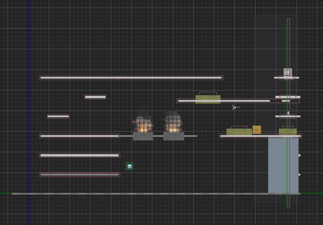&emsp;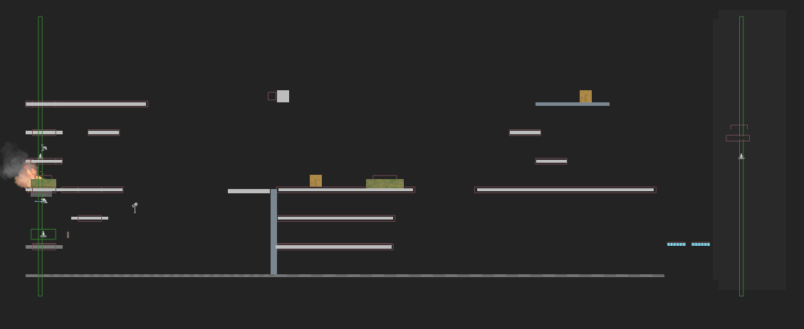

&emsp;&emsp;&emsp;&emsp;&emsp;Start

&emsp;

&emsp;

**Flight Simulator in VR Environment**

*Ge Gao, Xiaoyi Huang*

We built an interactive flight simulator in VR environment using traditional input devices such as keyboard, combined with third-party input devices specifically designed for VR devices, such as LeapMotion. (Using OpenGL and GLSL)

<video width="480" height="320" controls>
<source src="cgt521_GG&XYH_baofeng.mp4">
</video>

**Preferred Color of Light in Indoor Settings for Computer Generated Imagery**

*Jessica Balfe, Ge Gao, Sri Rama Kartheek Kappagantula, Yushan Wei*

We wanted to study whether warm lights are preferred in virtual indoor environment. We conducted an experiment which we showed videos(We built using Maya) to our participants, each video containing a walkthrough of an indoor room with warm white light, cool white light, dark and bright furnature. Our results indicate that majority of people prefer warm light to cool light in different conditions and that the parameters Intensity of light and color of furniture have little effect on a person’s preference for color of light.

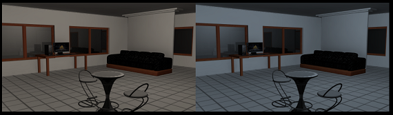  

**Digital on-campus information platform**

*Zheng Yan(Leader), Ge Gao, Mengnan Liu, Wei Tang*

We developing a information inquiry platform based on ArcGIS and Google Maps.

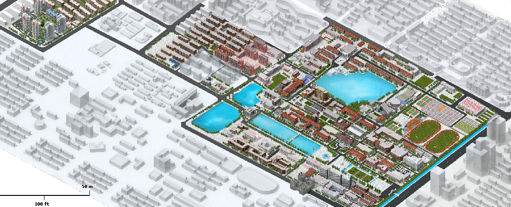&emsp;

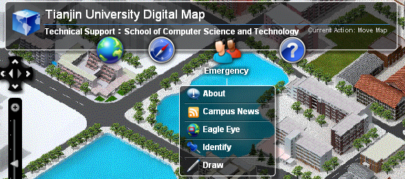&emsp;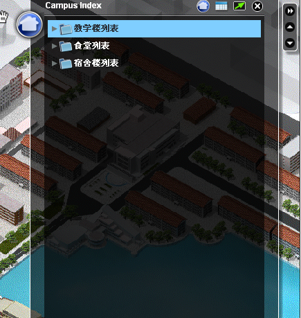

**A game based on 3DsMAX and 3DS Loader - Driving**(My first experience with game development)

*Ge Gao*

I developed a real-time rendering 3D driving game with interaction, animation, terrain, object picking, and particle effect. 

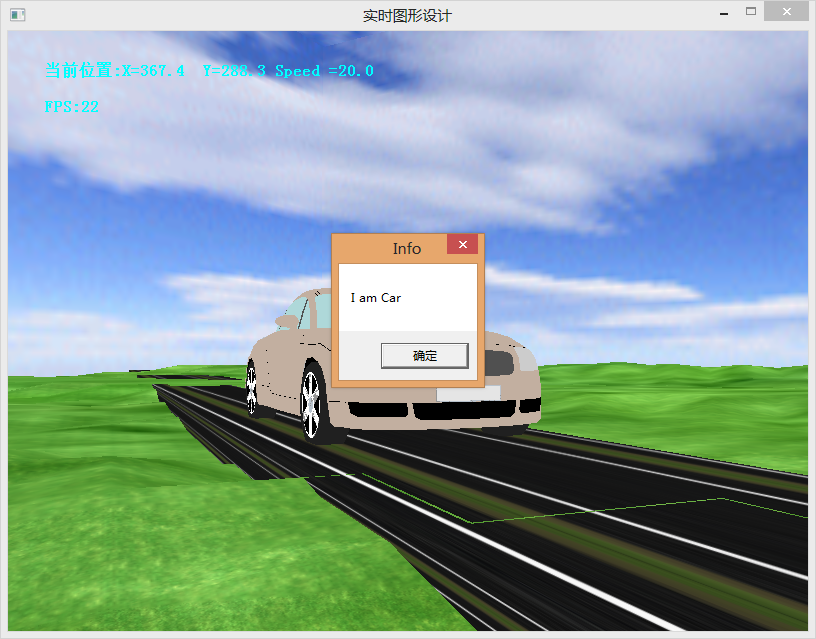&emsp;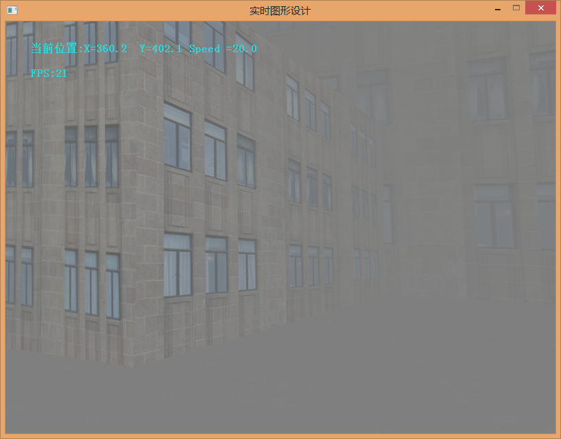&emsp;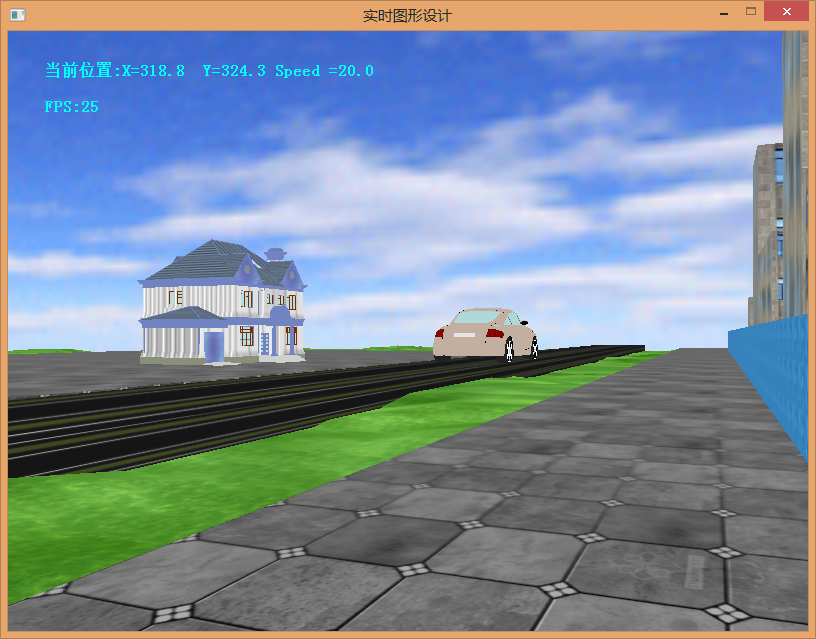

**C complier based on Antlr**

*Jiayuan Zhang(Leader), Ge Gao, Hongyao Huang*

We developed a complete C complier, including parse tree, intermediate code, interface design and so on. 

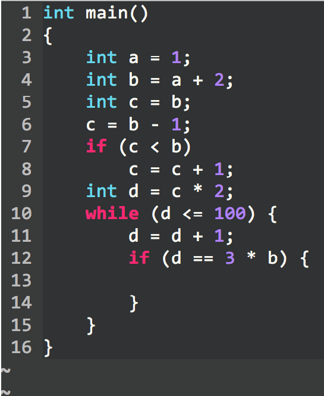&emsp;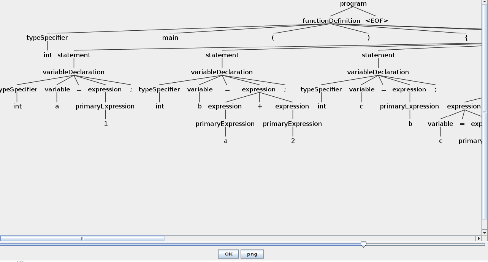&emsp;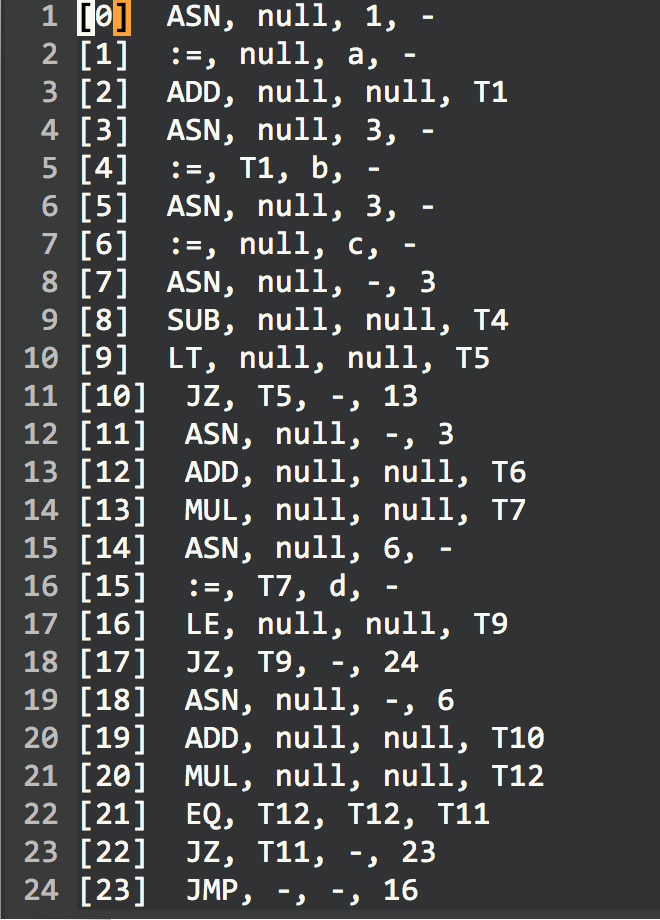

&emsp;&emsp;&emsp;Example&emsp;&emsp;&emsp;&emsp;&emsp;&emsp;&emsp;Parse Tree&emsp;&emsp;&emsp;&emsp;&emsp;&emsp;&emsp;Intermediate

**Visualization of contour line based on MFC of VS**

*Ge Gao*

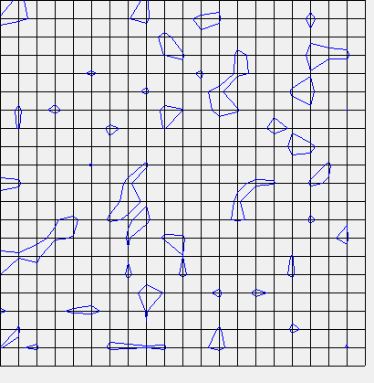&emsp;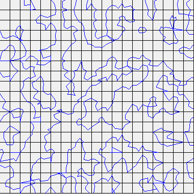&emsp;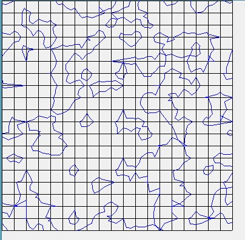

**Image Edge detection**

*Ge Gao*

I used four ways, including Prewitt, Sobel, Canny, and FDoG using MatLab.

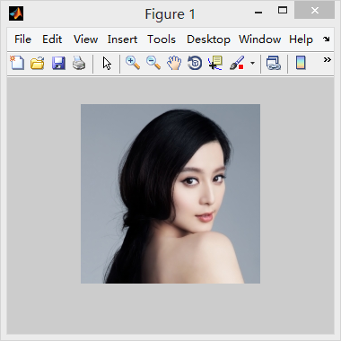

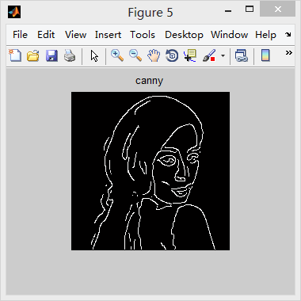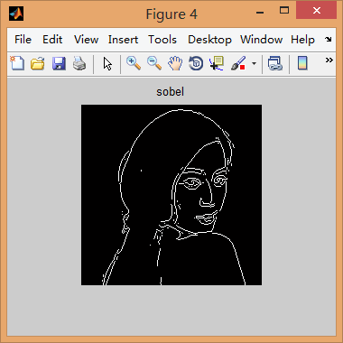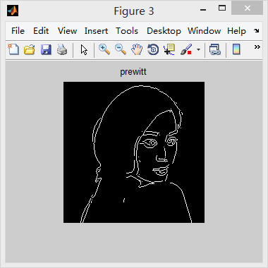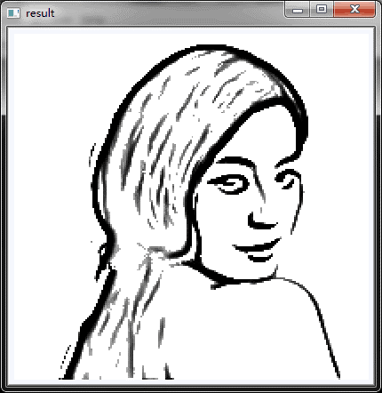

**Optimization of high contrasting photos**

*Ge Gao*

I realized this based on Tone Mapping algorithm.

-----------------------------------------------------------------------------------------------
### Selected Projects(About modeling & designing)

**Plant**(Using Maya and PhotoShop)

*Ge Gao*

&emsp; 

**Rock**(Using ZBrush, Substance Painter and Maya)

*Ge Gao*

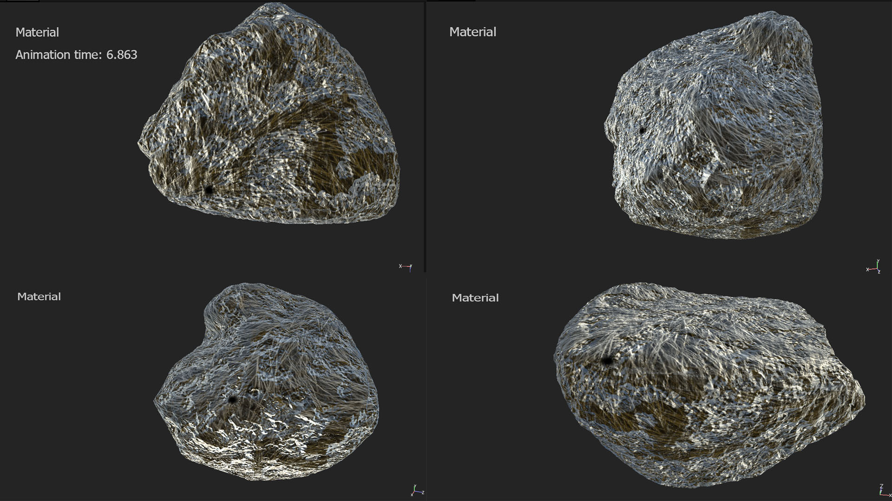

**Rose Capsule**(Using Maya and Substance Painter)

*Ge Gao, Concept from: Mr. Daniel Triplett*

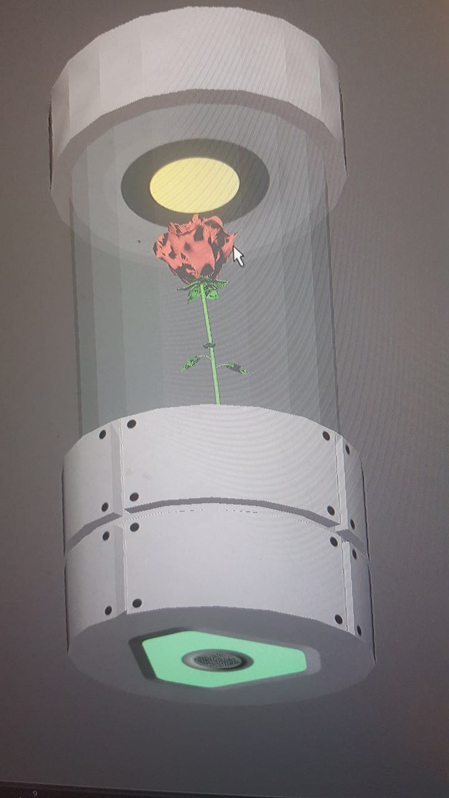&emsp;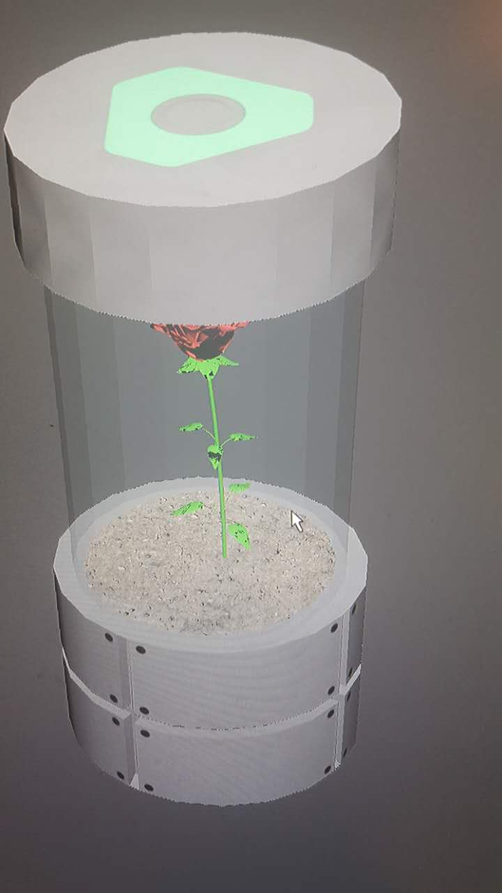

-----------------------------------------------------------------------------------------------
### B.E. Thesis

**Movie Box-Office Prediction Model and Visualization Based on Big Data**

*Supervised by Dr. [Shiguang Liu](http://www.tjucs.win/faculty/lsg/) (Department of Computer Science and Technology, Tianjin University)*

I began with the visualization of movie data and analyzed the effecting factor of box-office prediction. Then I set feature factors including directors, actors, and release schedule. Based on quantifying the feature factors with the data extracted from search engine and social media, the paper established a new scientific movie box-office revenue’s prediction model using training set. All in all, this paper realized the innovation of predicting method and improved the accuracy of movie box-office revenue’s prediction compared to previous work.

-----------------------------------------------------------------------------------------------
### M.S. Thesis

**The Effects on User Perception of Uniqueness of Three Factors as Applied to 3-Dimensional Tree Models**

*Supervised by Dr. [David M Whittinghill](https://polytechnic.purdue.edu/profile/davewhit), Dr. [Yingjie Chen](https://polytechnic.purdue.edu/profile/chen489) (Department of Computer Graphics Technology, Purdue University), Dr. [Qifan Song](https://www.stat.purdue.edu/people/faculty/qfsong) (Department of Statistics)*

The gaming industry always faces the continual challenges of striking balance between real-time computing performance and graphics presentation quality. This is particularly apparent for a game with vast wild-lands scenes which demands for a large number of tree models. From the visual perception perspective, this paper investigated whether people can distinguish trees with uniqueness of various features (relative orientation, density of branches, leaf color) using the same tree model in a virtual environment. During the controlled experiment, quantitative research methods were used, which measured the statistics of tree variations. The results suggested that our methods successfully contributed a strategy in saving graphic resources without user consciousness and maintaining high graphics performance.

-----------------------------------------------------------------------------------------------

### I believe you will enjoy the time we spend together.
